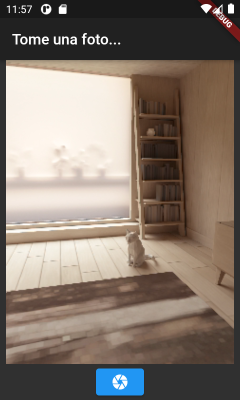
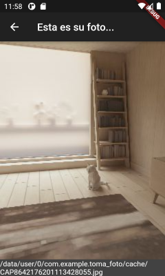

# TomaFoto

App Flutter para tomar fotos utilizando la cámara del sistema

## Preparación

Descargue el proyecto y ábralo en su IDE de preferencia. Android Studio y Visual Studio Code son muy apropiadas.

>Si tiene problemas con ello, tal vez deba revisar primero: https://github.com/dordonez-ute-moviles/Flutter-Tutorial

## Requisitos previos

- En el archivo *./pubspec.yaml* se incluyen las dependencias para los plugins que usaremos, en la sección `dependencies`, donde se añade `camera, path_provider y path`:

> *camera* permite usar la cámara de fotos del sistema; *path_provider* permite usar las ubicaciones más comunes dentro del sistema de archivos; *path* proporciona operaciones típicas de manipulación de paths

- El plugin *camera* tiene ciertas recomendaciones de versiones mínimas y permisos necesarios para su ejecución (https://pub.dev/packages/camera#installation).

  - Para Android, la compatibilidad mínima debe ser API 21 o superior, lo cual debe ser modificado en *./android/build.gradle*, en la sección `defaultConfig`, atributo `minSdkVersion`. 

  - En el caso de iOS, se debe añadir los permisos de uso de la cámara en el archivo *./ios/Runner/Info.plist*:
  ```xml
  <key>NSCameraUsageDescription</key>
  <string>Can I use the camera please?</string>
  <key>NSMicrophoneUsageDescription</key>
  <string>Can I use the mic please?</string>
  ```

## Programa

Todo el código fuente se encuentra en el archivo *./lib/main.dart*, que vamos a analizar a continuación.

- Al inicio del archivo se importan las librerías necesarias:

```dart
import 'dart:async';
import 'dart:io';
import 'package:camera/camera.dart';

import 'package:flutter/material.dart';
```

> *async* permitirá usar funciones asíncronas; *io* brinda los objetos para trabajar con archivos; *camera* proporciona los objetos para manipular la cámara del sistema.

- Ahora es necesaria la función main, por donde inicia la ejecución:

```dart
Future<void> main() async {
  WidgetsFlutterBinding.ensureInitialized();

  List<CameraDescription> cameras = await availableCameras();

  runApp(
    MaterialApp(
      theme: ThemeData.dark(),
      home: TakePicture(cameras.first),
    ),
  );
}
```

> Esta es una función asíncrona, como lo indica la palabra clave *async*, luego de main(). Al ser asíncrona es necesario que devuelva un `Future`, por lo cual el tipo del retorno ahora es `Future<void>`. Es necesario que main sea asíncrona dado que usa la palabra clave *await*, para esperar que termine la ejecución de *availableCameras* (que también es asíncrona); solo se puede usar *await* dentro de una función *async*.

> `WidgetsFlutterBinding.ensureInitialized();` se asegura que los plugins estén correctamente inicializados. Esto es necesario si se va a invocar la funcionalidad de algún plugin antes que se llame a *runApp*. En este caso es necesario por la llamada a *availableCameras*.

> `List<CameraDescription> cameras = await availableCameras();` obtiene la lista de todas las cámaras disponibles en el sistema. Esta es una función asíncrona, pero aquí usamos *await* para esperar a que termine su ejecución y tener directamente la información. Estamos pasando la primera cámara en la lista a `TakePicture(cameras.first),`

- A continuación necesitamos la página "home", que será la clase `TakePicture`. Esta página presentará el preview de la cámara y permitirá tomar una foto mediante un botón. Al ser una página con estado, utiliza `TakePictureState`:

```dart
class TakePicture extends StatefulWidget {
  TakePicture(this.camera);

  CameraDescription camera;

  @override
  TakePictureState createState() => TakePictureState();
}
```

- El siguiente paso es crear la clase `TakePictureState`, que es el `State` de `TakePicture`. Vamos a analizarla poco a poco:

```dart
class TakePictureState extends State<TakePicture> {
  late CameraController controller;
  late Future<void> isControllerReady;

  @override
  void initState() {
    super.initState();

    controller = CameraController(
      widget.camera,
      ResolutionPreset.low,
    );

    isControllerReady = controller.initialize();
  }

  @override
  void dispose() {
    controller.dispose();
    super.dispose();
  }
//...
```
> Al cargarse el objeto `State` se ejecuta *initState*, donde podemos inicializar el estado. Primero creamos un `CameraController`con el que gestionaremos la cámara; luego inicializamos dicho controlador para tomar control efectivo de la cámara. El método *initialize* es asíncrono, por lo que devuelve un `Future`; solo cuando el `Future` termine podremos usar la cámara (initState no puede ser *async*, por lo cual no podemos usar *await* al ejecutar *initialize*). Finalmente, es necesario liberar la cámara al terminar, por lo cual tenemos el método *dispose*, que se ejecutará al descargar el `State`; aquí liberamos la cámara mediante el método *dispose* del controlador.

- Luego, dentro de `TakePictureState` debemos crear el contenido gráfico (las widget) de la página, lo cual se hace, como siempre, en el método *build*. Lo más importante a destacar es que en esta página se usa la cámara, y esto requiere que el controlador se haya inicializado correctamente, lo cual puede demorar. Es necesario entonces, revisar el estado de 
*isControllerReady*, que es un `Future`, y solo cuando esté listo presentar el preview de la cámara; este es el rol del `FutureBuilder`:
```dart
//...
@override
  Widget build(BuildContext context) {
    return Scaffold(
      appBar: AppBar(title: const Text('Tome una foto...')),
      // Espera a que el controller se haya inicializado
      body: FutureBuilder<void>(
        future: isControllerReady,
        builder: (context, snapshot) {
          if (snapshot.connectionState == ConnectionState.done) {
            // Si el Future del controlador terminó, presenta el preview de la cámara
            return Center(
              child: Column(
                children: [
                  Expanded(
                    child: CameraPreview(controller),
                  ),
                  ElevatedButton(
                    child: Icon(Icons.camera),
                    onPressed: () async {
                      XFile image = await controller.takePicture();
                      Navigator.push(
                        context,
                        MaterialPageRoute(builder: (context) => ShowPicture(image.path)),
                      );
                    },
                  ),
                ],
              ),
            );
          } else {
            // Caso contrario presenta un indicador de "trabajando"
            return const Center(child: CircularProgressIndicator());
          }
        },
      ),
    );
  }
```

> Un `FutureBuilder` analiza el estado actual de un `Future` recibido en el atributo `future:`, en este caso *isControllerReady*; el componente decide qué presentar, dependiendo de dicho estado. Para construir la(s) widget a presentar, se requiere pasar una función al atributo `builder:`; esta función básicamente analiza el estado del *snapshot* recibido en parámetro, mediante `snapshot.connectionState`. En este caso, si el estado es `ConnectionState.done`, se puede usar la cámara y se presenta el preview y un botón para tomar la foto, caso contrario, se presenta solamente un `CircularProgressIndicator` que indica que se está aún trabajando.

> Para el preview se pasa un `CameraPreview` con el controlador como parámetro. Para tomar la foto, el botón define una función asíncrona en `onPressed:`. Aquí el controlador llama a *takePicture*; este método es asíncrono, por lo que lo esperamos con un *await* y recibimos un `XFile`, que representa el archivo donde está la foto tomada. Finalmente cargamos la página que presentará la foto (`ShowPicture`), pasándole como argumento el path en el `XFile`. 

- Ya para terminar el ejemplo, necesitamos la página `ShowPicture`, que presentará tanto la imagen tomada, como, al pie de la página, el path donde se guardó el archivo con la imagen. Este archivo es solamente temporal, de manera que será eliminado al terminar la aplicación (se puede guardar permanentemente, claro):

```dart
class ShowPicture extends StatelessWidget {
  ShowPicture(this.imgpath);

  final String imgpath;

  @override
  Widget build(BuildContext context) {
    return Scaffold(
      appBar: AppBar(title: Text('Esta es su foto...')),
      body: Container(
        child: Image.file(File(imgpath), fit: BoxFit.cover),
        width: MediaQuery.of(context).size.width,
      ),
      bottomNavigationBar: BottomAppBar(child: Text('${imgpath}')),
    );
  }
}
```

> La imagen tomada se presenta dentro de un `Container`, al cual se le está instruyendo que ocupe todo el ancho de la pantalla, con el atributo `width:`. La imagen se carga con un `Image`, que la recupera del archivo, y la presenta ajustándola al container mediatne el atributo `fit:`. Fialmente, al fondo de la pantalla se usa el `bottomNavigationBar:` para persentar un `BottomAppBar`, que en este casos tendrá solamente un `Text`con el path de la imagen.

Al ejecutarse la aplicación se debería ver algo parecido a las imágenes que se presentan a continuación:

 